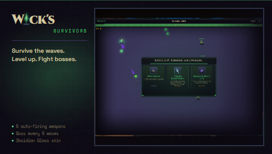

<p align="center"></p>

# Wick's Survivors

> Vampire Survivors-style wave survival minigame for TBC Classic Anniversary. Survive endless undead waves, level up weapons and passives, and fight iconic bosses.

Part of the **[Wick suite](https://github.com/Wicksmods/WickSuite)**: precision addons built around a single fel-green-on-deep-purple aesthetic.

<!-- wick:suite-table:start -->
| Addon | GitHub | CurseForge |
|---|---|---|
| **Wick's TBC BIS Tracker** | [repo](https://github.com/Wicksmods/WickidsTBCBISTracker) | [CurseForge](https://www.curseforge.com/wow/addons/wicks-tbc-bis-tracker) |
| **Wick's CD Tracker** | [repo](https://github.com/Wicksmods/WicksCDTracker) | [CurseForge](https://www.curseforge.com/wow/addons/wicks-cd-tracker) |
| **Wick's Trade Hall** | [repo](https://github.com/Wicksmods/WicksTradeHall) | [CurseForge](https://www.curseforge.com/wow/addons/trade-hall) |
| **Wick's Macro Builder** | [repo](https://github.com/Wicksmods/WicksMacroBuilder) | [CurseForge](https://www.curseforge.com/wow/addons/wicks-macro-builder) |
| **Wick's Combat Log** | [repo](https://github.com/Wicksmods/WicksCombatLog) | [CurseForge](https://www.curseforge.com/wow/addons/wicks-combat-log) |
| **Wick's Stats** | [repo](https://github.com/Wicksmods/WicksStats) | [CurseForge](https://www.curseforge.com/wow/addons/wicks-stats) |
| **Wick's Quest Key** | [repo](https://github.com/Wicksmods/WicksQuestKey) | [CurseForge](https://www.curseforge.com/wow/addons/wicks-quest-key) |
| **Wick's Totems and Things** | [repo](https://github.com/Wicksmods/WicksTotemsAndThings) | [CurseForge](https://www.curseforge.com/wow/addons/wicks-totems-and-things) |
| **Wick's Bags** | [repo](https://github.com/Wicksmods/WicksBags) | [CurseForge](https://www.curseforge.com/wow/addons/wicks-bags) |
| **Wick's Travel Form** | [repo](https://github.com/Wicksmods/WicksTravelForm) | [CurseForge](https://www.curseforge.com/wow/addons/wicks-travel-form) |
| **Wick's Ledger** | [repo](https://github.com/Wicksmods/WicksLedger) | [CurseForge](https://www.curseforge.com/wow/addons/wicks-ledger) |
| **Wick's Wardrobe** | [repo](https://github.com/Wicksmods/WicksWardrobe) | [CurseForge](https://www.curseforge.com/wow/addons/wicks-wardrobe) |
| **Wick's Concession Stand** | [repo](https://github.com/Wicksmods/WicksConcessionStand) | [CurseForge](https://www.curseforge.com/wow/addons/wicks-concession-stand) |
| **Wick's Bones** | [repo](https://github.com/Wicksmods/WicksBones) | [CurseForge](https://www.curseforge.com/wow/addons/wicks-bones) |
| **Wick's Survivors** | [repo](https://github.com/Wicksmods/WicksSurvivors) | [CurseForge](https://www.curseforge.com/wow/addons/wicks-survivors) |

**Community:** [Discord](https://discord.gg/GWGTMhYBZY)
<!-- wick:suite-table:end -->

## Features

- **5 auto-firing weapons** that activate and combine as you level up.
- **Passive upgrades** — lifesteal, speed, area, cooldown reduction, and more.
- **Boss waves every 6 rounds** — iconic TBC encounters scaled to the minigame.
- **Obsidian Glass skin** — a full art reskin included from day one.
- **Wick chrome.** Flat dark-purple panel, fel-green L-bracket corners, draggable and resizable.

## Install

- **CurseForge:** [curseforge.com/wow/addons/wicks-survivors](https://www.curseforge.com/wow/addons/wicks-survivors)
- **Manual:** download the latest ZIP from [Releases](https://github.com/Wicksmods/WicksSurvivors/releases) and extract the `WicksSurvivors` folder into `World of Warcraft\_anniversary_\Interface\AddOns\`.

## Usage

```
/survivors
```

Opens the game window. Use your mouse to move, weapons fire automatically.

| Command | Effect |
|---|---|
| `/survivors` | Open or close the game |
| `/survivors reset` | Reset position to default |

## Compatibility

- **TBC Classic (Burning Crusade / Anniversary)** — Interface `20505`.

## Brand

Uses the locked Wick palette and 10px/2px fel-green L-bracket chrome. See:
- `UI.lua` — palette tokens at the top of the file
- `CHANGELOG.md` — version history

## License

See `LICENSE` — MIT with a trademark carve-out for the Wick name, logomark, and visual system. Full trademark policy: [WickSuite/TRADEMARK.md](https://github.com/Wicksmods/WickSuite/blob/main/TRADEMARK.md).
